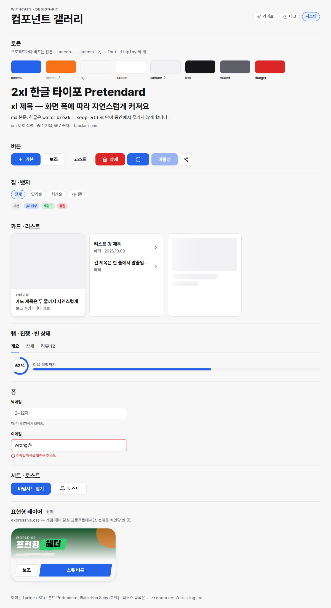

# design-kit — 공용 웹프론트 디자인 키트

모든 프로젝트가 같은 출발선에서 시작하도록 만든 **자료 100선 + 바로 복사해 쓰는 스타터**.
`40_템플릿/` 이 화면 단위 골격(랜딩 등)이라면, 여기는 그 아래 깔리는 **디자인 기반**(토큰·컴포넌트·아이콘·규칙)이다.

```
design-kit/
├─ resources/
│  ├─ catalog.json      자료 100선 원본 (수정은 여기서만)
│  ├─ catalog.md        ↑ 에서 생성한 읽기용 표   ← node scripts/build-catalog.mjs
│  └─ licenses.md       라이선스 빠른 판단표 (상업 사이트 기준)
├─ guidelines/
│  ├─ ux-checklist.md   출시 전 UX·접근성 점검표 (WCAG 2.2)
│  ├─ typography-ko.md  한국어 타이포 규칙·폰트 조합·UX 라이팅
│  └─ motion.md         모션 토큰·원칙·상황별 처방
├─ scripts/build-catalog.mjs
└─ starter/             복사해서 쓰는 부분
   ├─ index.html        컴포넌트 갤러리 (데모 겸 사용 예시)
   ├─ css/tokens.css      의미 기반 토큰, 라이트/다크, 유동 타입
   ├─ css/base.css        리셋·한글 줄바꿈·포커스·레이아웃 헬퍼
   ├─ css/components.css  kit-* 컴포넌트 (모든 상태 포함)
   ├─ css/expressive.css  선택: 붓칠·잉크 튐·스큐 (게임·애니 톤)
   ├─ js/kit.js           시트·토스트·탭·토글·테마 (의존성 0, ES 모듈)
   ├─ icons/              Lucide 53종 스프라이트 (+ 라이선스)
   └─ scripts/build-icons.mjs
```



다크: [docs/gallery-dark.png](docs/gallery-dark.png) · 모바일: [docs/gallery-mobile.png](docs/gallery-mobile.png)

## 다운로드

이 폴더는 바깥 파일을 참조하지 않는다. 폴더만 받아서 바로 쓰면 된다.

- **zip 한 번에:** 저장소 루트의 [`design-kit.zip`](../design-kit.zip) → GitHub 에서 열고 "Download raw file".
- **zip 새로 만들기** (폴더 수정 후): 저장소 루트에서
  `git archive --format=zip --prefix=design-kit/ -o design-kit.zip HEAD:design-kit`
  (커밋된 파일만 담기므로 `node_modules` 는 빠진다)
- 폰트(Pretendard·Black Han Sans)는 CDN 에서 불러오므로 인터넷 연결이 필요하다. 아이콘은 폴더 안에 들어 있다.

## 자료 100선

13개 분류 × 100개. 각 항목에 라이선스·GitHub 별 구간·추천도·쓰임을 적었고, 저장소 경로·라이선스·유지보수 상태를 2026-10 기준으로 하나씩 확인했다.

| 분류 | 개수 | 분류 | 개수 |
|---|---|---|---|
| A 디자인 시스템 | 10 | H 표현형·게임 UI | 8 |
| B 컴포넌트·헤드리스 | 10 | I 데이터 시각화 | 6 |
| C CSS·토큰·리셋 | 8 | J 접근성·품질 | 8 |
| D 타이포·한글 폰트 | 8 | K 색상·테마 | 5 |
| E 아이콘 | 8 | L 큐레이션 목록 | 6 |
| F 애니메이션 | 10 | M 스타터 템플릿 | 3 |
| G 인터랙션 부품 | 10 | | |

추천도: ★★★ 기본 탑재 · ★★ 상황별 1순위 · ★ 참고·학습. 보관(archived)·장기 미관리 저장소는 대체 자료로 교체했고, 배울 가치만 남은 것은 "참고용"으로 표시했다.
→ [resources/catalog.md](resources/catalog.md)

## 스타터 쓰는 법

1. `starter/css`, `starter/js`, `starter/icons` 를 프로젝트로 복사.
2. `tokens.css` 맨 위 **브랜드 블록만** 바꾼다.
   ```css
   --accent: #e11d48;      /* 주 행동색 */
   --accent-2: #facc15;    /* 보조 강조 */
   --on-accent: #fff;      /* accent 위 글자 — 대비 4.5:1 확인 */
   --font-display: 'Black Han Sans', var(--font);   /* 선택 */
   ```
3. HTML 에 연결:
   ```html
   <link rel="stylesheet" href="css/tokens.css">
   <link rel="stylesheet" href="css/base.css">
   <link rel="stylesheet" href="css/components.css">
   <!-- 게임·애니 톤이면 --> <link rel="stylesheet" href="css/expressive.css">
   <script type="module">
     import { initKit, toast } from './js/kit.js';
     initKit();
   </script>
   ```
4. 아이콘: `icons/icons.svg` 내용을 `<body>` 바로 아래 넣고 `<svg class="ic"><use href="#i-heart"/></svg>`.
   서버 사이드(PHP·Astro)면 파일을 그대로 include, 정적 JS 페이지면 `icons.inline.js` 의 `SPRITE` 를 삽입.
   아이콘 추가: `scripts/build-icons.mjs` 의 목록에 이름 추가 → `npm install && npm run icons`.

갤러리 보기: `cd starter && npx serve .` (ES 모듈이라 `file://` 로는 열리지 않는다).

### 컴포넌트

| 클래스 | 내용 |
|---|---|
| `kit-btn` | `is-secondary` `is-ghost` `is-danger` `is-sm` `is-block` `is-icon`, `disabled`, `aria-busy` 스피너 |
| `kit-chip` / `kit-chips` | 필터·토글 칩 (`aria-pressed`, `data-single` 단일 선택) |
| `kit-card` `kit-row` `kit-badge` `kit-eyebrow` | 카드·리스트 행·뱃지 |
| `kit-tabs` | WAI-ARIA 탭 (←/→/Home/End) |
| `kit-field` `kit-input` | 라벨·도움말·오류(`aria-invalid`) |
| `kit-ring` `kit-progress` | 원형·막대 진행률 |
| `kit-skeleton` `kit-empty` | 로딩·빈 상태 |
| `kit-tabbar` | 하단 탭바 (`aria-current`) |
| `kit-sheet` | `<dialog>` 바텀시트 — 포커스 가두기·Esc 기본 |
| `kit-toasts` | `toast()` 알림 (`aria-live`) |
| `[data-tip]` | 짧은 툴팁 |

## 설계 원칙

- **바꾸는 건 3개, 나머지는 공통** — 브랜드 토큰만 프로젝트마다 다르고, 컴포넌트·접근성은 한 번 검증해 재사용.
- **의미 기반 토큰** — `--blue-500` 이 아니라 `--accent`, `--surface`, `--muted`. 다크 모드가 토큰 교체만으로 끝난다.
- **플랫폼 우선** — `<dialog>`, `:focus-visible`, `color-mix()`, `clamp()`, `text-wrap` 등 브라우저 기본 기능을 쓰고 JS 는 최소.
- **표현형은 선택 레이어** — 붓칠·스큐 같은 개성은 `expressive.css` 에 격리. 차분한 서비스엔 빼면 된다.

## 마이키티 프로젝트와의 관계

`nakojin/my-kitty` 의 프로토타입·WordPress 테마에서 검증한 패턴(붓칠 패널, 바텀시트, Lucide 스프라이트, Pretendard + Black Han Sans)을 일반화한 것이다. 마이키티에 역으로 적용할 때는 `tokens.css` 브랜드 블록에 마이키티 색을 넣고 `expressive.css` 를 함께 쓰면 된다.
